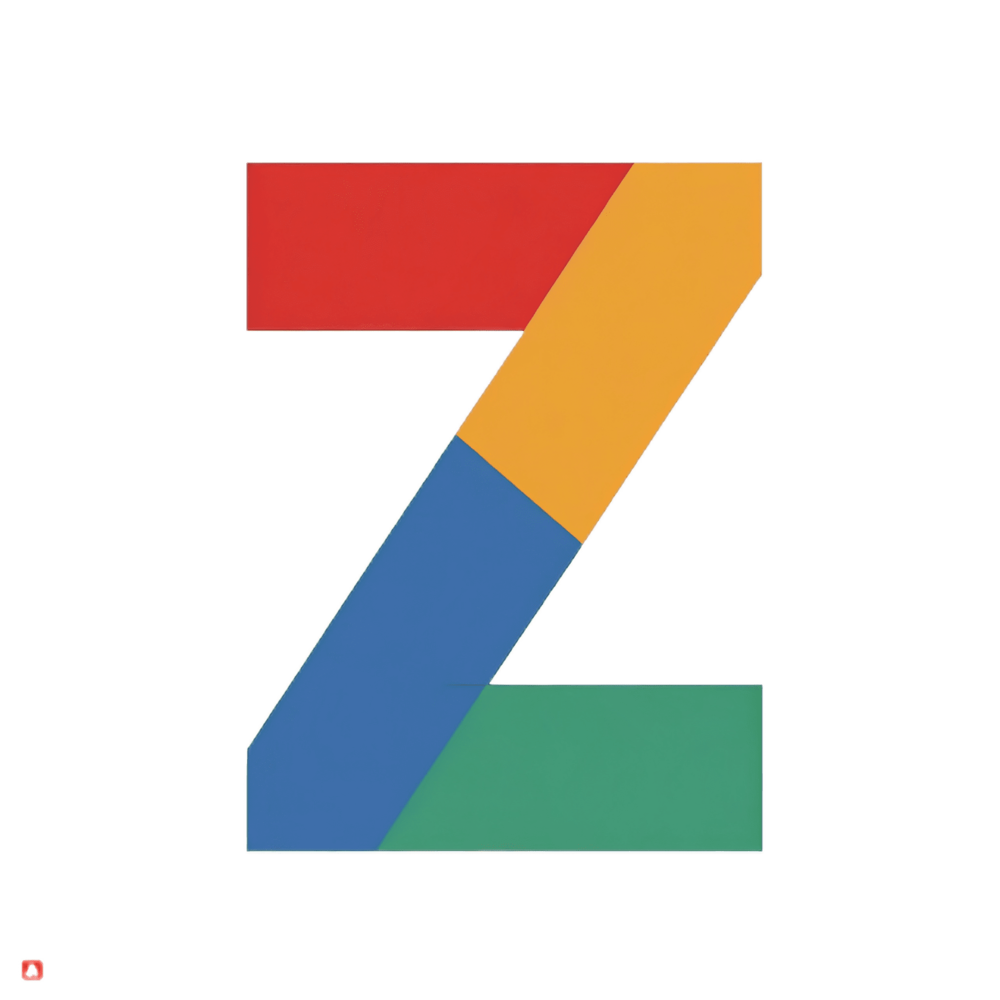

# Zmail

<p align="center">
<br>
<span>Gmail styled portfolio app in NextJS.</span>  
</p>


## Features

- Node v20
- React v18
- Next v13.5 (App Router with server and client Components)
- TypeScript v5
- Code Quality: Prettier, ESLint, Husky
- CI/CD: GitHub Actions
- Hosting: GitHub Pages
- Icons: MUI

## Setup

```bash
brew install git node
git clone https://github.com/ahampriyanshu/zmail.git
cd zmail
yarn
yarn dev
```
